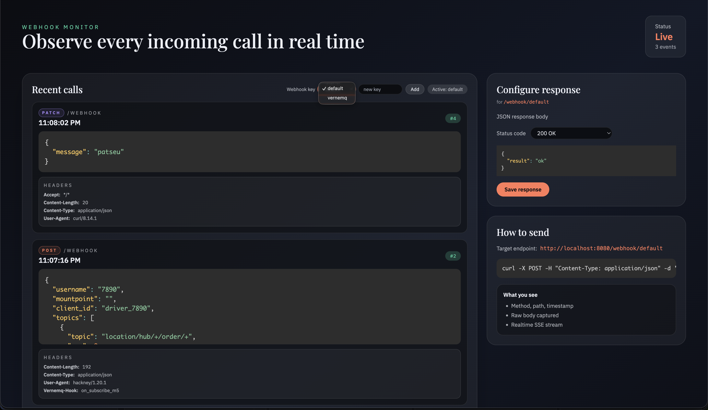

<div align="center">

# 🧪 Hooklab

**Capture, inspect, and debug webhooks in real-time.**

[](https://go.dev/)
[](https://codecov.io/github/essajiwa/webhook-test)
[](LICENSE)
[](https://github.com/essajiwa/hooklab)
[](https://github.com/essajiwa/hooklab/fork)

[Features](#features) • [Quick Start](#quick-start) • [API](#api-endpoints) • [Contributing](#contributing)

</div>

---

## The Problem

Testing webhooks is painful:
- **ngrok setup** for every project
- **No visibility** into what's being sent
- **Hard to simulate** different response scenarios
- **Context switching** between terminal and browser

## The Solution

A **single binary** webhook server with a beautiful embedded UI. Zero config, instant feedback.



---

## Features

| Feature | Description |
|---------|-------------|
| 🔀 **Per-key Routing** | `/webhook/{key}` — each key has independent response config |
| ⚡ **Real-time Updates** | SSE streaming, see requests as they arrive |
| 🎨 **Beautiful UI** | Embedded React + Tailwind, color-coded HTTP methods |
| 🔧 **Configurable Responses** | Set status codes and JSON responses per endpoint |
| 📦 **Single Binary** | No dependencies, just `go run .` |
| 🧪 **84%+ Test Coverage** | Production-ready code quality |

---

## Quick Start

### Requirements
- Go 1.18 or later

### Run
```sh
go run .
```

### Open UI
```
http://localhost:8080
```

### Send a Webhook
```sh
curl -X POST \
  -H "Content-Type: application/json" \
  -d '{"message":"hello"}' \
  http://localhost:8080/webhook
```

### Use Custom Keys
Each key gets its own response configuration:
```sh
# Stripe webhooks
curl -X POST -d '{"type":"payment"}' http://localhost:8080/webhook/stripe

# GitHub webhooks  
curl -X POST -d '{"action":"push"}' http://localhost:8080/webhook/github
```

---

## Configuration

| Flag | Description | Default |
|------|-------------|---------|
| `-port` | HTTP server port | `8080` |
| `-response` | Default JSON response | `{"result":"ok"}` |

---

## API Endpoints

| Method | Endpoint | Description |
|--------|----------|-------------|
| `ANY` | `/webhook` or `/webhook/{key}` | Capture webhook, return configured response |
| `GET` | `/api/events?key={key}` | List recent events (optional key filter) |
| `GET` | `/api/stream` | SSE stream of all events |
| `GET` | `/api/response?key={key}` | Get response config for a key |
| `POST` | `/api/response?key={key}` | Update response config `{ response, statusCode }` |

---

## Why This Over Alternatives?

| | Hooklab | webhook.site | ngrok |
|---|:---:|:---:|:---:|
| Self-hosted | ✅ | ❌ | ❌ |
| Per-key routing | ✅ | ❌ | ❌ |
| Custom responses | ✅ | Limited | ❌ |
| Real-time UI | ✅ | ✅ | ❌ |
| Free & Open Source | ✅ | Freemium | Freemium |
| Single binary | ✅ | N/A | ❌ |

---

## Contributing

Contributions are welcome! Please see [CONTRIBUTING.md](CONTRIBUTING.md) for guidelines.

Look for issues labeled [`good first issue`](https://github.com/essajiwa/webhook-test/labels/good%20first%20issue) to get started.

---

## Built With

- **[Go](https://go.dev/)** — Fast, reliable backend
- **[React](https://react.dev/)** — Interactive UI
- **[Tailwind CSS](https://tailwindcss.com/)** — Beautiful styling
- **AI Assistance** — Built with help from [Claude](https://claude.ai/) & [Windsurf](https://codeium.com/windsurf)

---

## License

MIT — see [LICENSE](LICENSE).

---

<div align="center">

**[⬆ Back to top](#-hooklab)**

Made with ❤️ by [@essajiwa](https://github.com/essajiwa)

</div>
