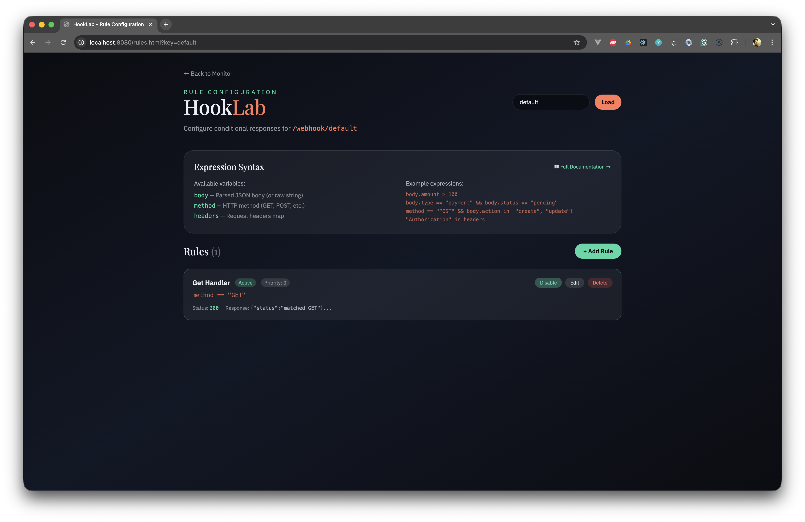
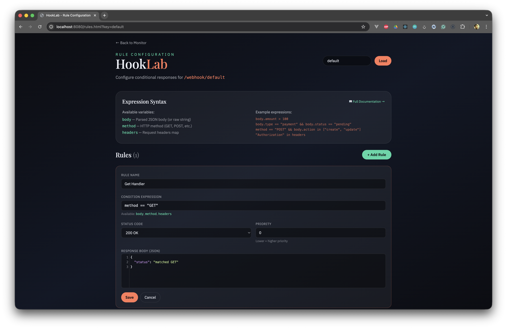

<div align="center">

# 🧪 Hooklab

**Mock APIs. Test webhooks. Debug integrations.**

[](https://goreportcard.com/report/github.com/essajiwa/hooklab)
[](https://go.dev/)
[](https://codecov.io/github/essajiwa/hooklab)  
[](https://github.com/essajiwa/hooklab/actions/workflows/main.yml)
[](LICENSE)
[](https://github.com/essajiwa/hooklab)
[](https://github.com/essajiwa/hooklab/fork)

[Features](#features) • [Use Cases](#use-cases) • [Quick Start](#quick-start) • [API](#api-endpoints) • [Contributing](#contributing)

</div>

---

## The Problem

Testing integrations is painful:
- **ngrok setup** for every webhook project
- **No visibility** into what external services send
- **Hard to mock** third-party API responses in tests
- **Context switching** between terminal and browser

## The Solution

A **single binary** server that captures webhooks AND mocks API responses. Zero config, instant feedback, beautiful UI.


---

## Features

| Feature | Description |
|---------|-------------|
| 🔀 **Per-key Routing** | `/webhook/{key}` — each key has independent response config |
| 🧪 **Mock API Server** | Use as a mock server in unit/integration tests |
| ⚡ **Rule Engine** | Expression-based conditional responses ([docs](RULES.md)) |
| 🎯 **Real-time Updates** | SSE streaming, see requests as they arrive |
| 🎨 **Beautiful UI** | Embedded React + Tailwind, color-coded HTTP methods |
| 🔧 **Configurable Responses** | Set status codes and JSON responses per endpoint |
| 📦 **Single Binary** | No dependencies, just `go run .` |

---

## Quick Start

### Requirements
- Go 1.18 or later

### Run
```sh
go run .
```

### Open UI
```
http://localhost:8080
```

### Send a Webhook
```sh
curl -X POST \
  -H "Content-Type: application/json" \
  -d '{"message":"hello"}' \
  http://localhost:8080/webhook
```

### Use Custom Keys
Each key gets its own response configuration:
```sh
# Stripe webhooks
curl -X POST -d '{"type":"payment"}' http://localhost:8080/webhook/stripe

# GitHub webhooks  
curl -X POST -d '{"action":"push"}' http://localhost:8080/webhook/github
```

---

## Use Cases

### 1. Webhook Testing
Capture and inspect incoming webhooks from external services:
```sh
# Point Stripe/GitHub/etc. to your Hooklab instance
curl -X POST -d '{"event":"payment.success"}' http://localhost:8080/webhook/stripe
```

### 2. Mock API Server
Use Hooklab as a mock server in your tests:

**JavaScript/Jest:**
```javascript
// Configure mock response before test
await fetch('http://localhost:8080/api/response?key=payment-api', {
  method: 'POST',
  headers: { 'Content-Type': 'application/json' },
  body: JSON.stringify({
    response: { id: 'ch_123', status: 'succeeded' },
    statusCode: 200
  })
});

// Your code calls the mock instead of real API
const result = await paymentService.charge({
  apiUrl: 'http://localhost:8080/webhook/payment-api'
});

expect(result.status).toBe('succeeded');
```

**Go:**
```go
// Setup: configure Hooklab response
resp, _ := http.Post(
    "http://localhost:8080/api/response?key=external-api",
    "application/json",
    strings.NewReader(`{"response":{"success":true},"statusCode":200}`),
)

// Test: point your code to Hooklab
client := NewClient("http://localhost:8080/webhook/external-api")
result, err := client.DoSomething()
assert.True(t, result.Success)
```

### 3. Error Simulation
Test how your code handles failures:
```sh
# Configure 500 error response
curl -X POST http://localhost:8080/api/response?key=flaky-api \
  -H "Content-Type: application/json" \
  -d '{"response":{"error":"Internal Server Error"},"statusCode":500}'

# Your integration tests can now verify error handling
```

### 4. Rule Engine
Create conditional responses based on request data:
```sh
# Create a rule: return error for high-value transactions
curl -X POST "http://localhost:8080/api/rules?key=payments" \
  -H "Content-Type: application/json" \
  -d '{
    "name": "High Value Alert",
    "condition": "body.amount > 1000",
    "response": {"status": "review_required"},
    "statusCode": 202,
    "priority": 1,
    "enabled": true
  }'
```

Rules are evaluated in priority order. First match wins. See [RULES.md](RULES.md) for full expression syntax.

<details>
<summary>📸 Rule Engine Screenshots</summary>

**Rules List**


**Rule Editor**


</details>

### 5. CI/CD Integration
Run Hooklab in your CI pipeline:
```yaml
# GitHub Actions example
services:
  hooklab:
    image: golang:1.21
    ports:
      - 8080:8080
    command: go run github.com/essajiwa/hooklab@latest
```

---

## Configuration

| Flag | Description | Default |
|------|-------------|---------|
| `-port` | HTTP server port | `8080` |
| `-response` | Default JSON response | `{"result":"ok"}` |

---

## API Endpoints

| Method | Endpoint | Description |
|--------|----------|-------------|
| `ANY` | `/webhook` or `/webhook/{key}` | Capture webhook, return configured response |
| `GET` | `/api/events?key={key}` | List recent events (optional key filter) |
| `GET` | `/api/stream` | SSE stream of all events |
| `GET` | `/api/response?key={key}` | Get response config for a key |
| `POST` | `/api/response?key={key}` | Update response config `{ response, statusCode }` |
| `GET` | `/api/rules?key={key}` | List rules for a webhook key |
| `POST` | `/api/rules?key={key}` | Create a new rule |
| `PUT` | `/api/rules?key={key}&id={id}` | Update an existing rule |
| `DELETE` | `/api/rules?key={key}&id={id}` | Delete a rule |
| `GET` | `/api/keys` | List all known webhook keys |

---

## Why This Over Alternatives?

| | Hooklab | webhook.site | ngrok |
|---|:---:|:---:|:---:|
| Self-hosted | ✅ | ❌ | ❌ |
| Per-key routing | ✅ | ❌ | ❌ |
| Custom responses | ✅ | Limited | ❌ |
| Rule engine | ✅ | ❌ | ❌ |
| Real-time UI | ✅ | ✅ | ❌ |
| Free & Open Source | ✅ | Freemium | Freemium |
| Single binary | ✅ | N/A | ❌ |

---

## ⚠️ Security Considerations

Hooklab is designed as a **development and testing tool**. Before deploying:

| Concern | Status | Notes |
|---------|--------|-------|
| **Authentication** | ❌ None | All endpoints are public by default |
| **Request Size** | ✅ Limited | Bodies capped at 1MB to prevent DoS |
| **Data Exposure** | ⚠️ Caution | Request headers (including auth tokens) are stored and displayed |
| **Rate Limiting** | ❌ None | No built-in rate limiting |

**Recommendations:**
- **Do NOT expose to the public internet** without a reverse proxy (nginx, Caddy) with authentication
- Use behind a VPN or firewall for team access
- Consider the systemd service with `RuntimeMaxSec` for periodic data reset
- Sensitive headers (`Authorization`, `Cookie`, etc.) will be visible in the UI

---

## Contributing

Contributions are welcome! Please see [CONTRIBUTING.md](CONTRIBUTING.md) for guidelines.

Look for issues labeled [`good first issue`](https://github.com/essajiwa/hooklab/labels/good%20first%20issue) to get started.

---

## Built With

- **[Go](https://go.dev/)** — Fast, reliable backend
- **[React](https://react.dev/)** — Interactive UI
- **[Tailwind CSS](https://tailwindcss.com/)** — Beautiful styling
- **AI Assistance** — Built with help from [Claude](https://claude.ai/) & [Windsurf](https://codeium.com/windsurf)

---

## License

MIT — see [LICENSE](LICENSE).

---

<div align="center">

**[⬆ Back to top](#-hooklab)**

Made with ❤️ by [@essajiwa](https://github.com/essajiwa)

</div>
